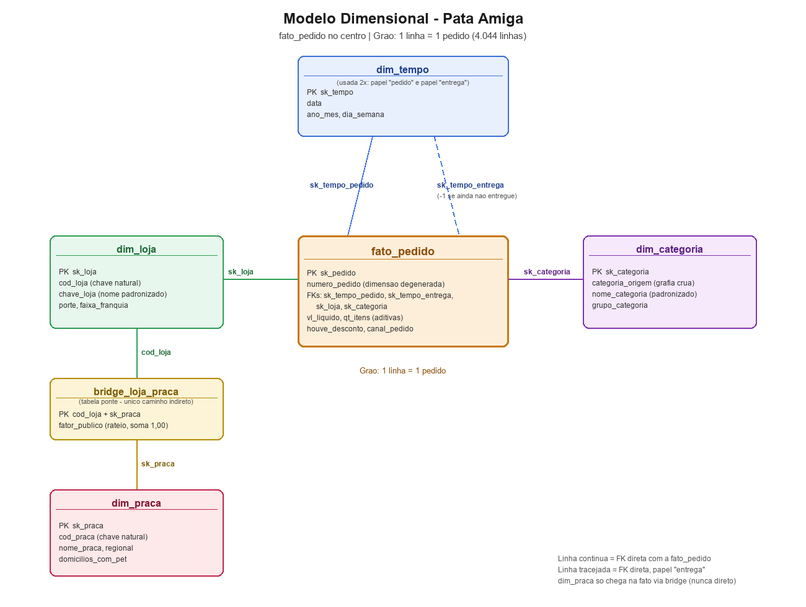

# Mini-Projeto Avaliativo - Modelo Dimensional PostgreSQL (Pata Amiga)

Projeto da disciplina **Análise de Dados com Python [T1] - Módulo 2 - Semana 7**.

## 1. O case

A Pata Amiga é uma rede catarinense de pet shops, com 32 lojas em Santa Catarina.
Os pedidos chegam por vários canais (app, site, telefone, WhatsApp, loja física) e
vêm de três sistemas que não se conversam: a plataforma de e-commerce, o cadastro
de lojas do franchising e a planilha de praças de atendimento.

O objetivo deste projeto é pegar essas três tabelas "sujas" (nomes de coluna
fora de padrão, datas em formatos diferentes, texto onde deveria ser número,
a mesma loja escrita de várias formas) e construir um **modelo dimensional em
estrela** no PostgreSQL, capaz de responder com números confiáveis a cinco
perguntas de negócio:

1. Onde está o gargalo da entrega?
2. Qual categoria concentra o faturamento?
3. O desconto funciona igual em todo canal?
4. Qual praça de atendimento concentra o faturamento?
5. Onde abrir a próxima loja, e o que os dados **não** permitem afirmar?

## 2. Diagnóstico da Origem (Tarefa 1)

Antes de tratar qualquer coisa, rodei o `sql/01-carga-staging.sql` (que cria o banco
`dw_pata_amiga` e carrega as 3 tabelas de origem exatamente como vieram dos
sistemas) e depois `sql/diagnostico.sql`, só para medir o tamanho da bagunça.
Os números batem com os valores de conferência do enunciado:

| O que foi medido | Valor encontrado | O que isso significa |
|---|---|---|
| Linhas em `stg_pedido` / `stg_loja` / `stg_loja_praca` | 4.044 / 32 / 48 | Confirma que a carga da staging veio completa. |
| Grafias distintas de `CategoriaProduto` | 37 | A mesma categoria (ex.: ração) está escrita de até 37 jeitos diferentes. Por isso a `dim_categoria` precisa de um "de-para". |
| Grafias distintas de `Loja-Nome` | 128 | O nome da loja vem com acento, sem acento, maiúscula/minúscula, sufixo "/SC", espaço sobrando e erro de digitação. |
| Grafias distintas de `HouveDesconto` | 17 | "Sim" pode vir como `S`, `SIM`, `1`, `X`, `TRUE`, `V`, etc. |
| Grafias distintas de `CanalPedido` | 20 | O mesmo canal (ex.: WhatsApp) aparece escrito de formas diferentes. |
| Pedidos sem `Cod Loja` preenchido | 1.575 (~39%) | Quase 4 em cada 10 pedidos não têm o código da loja — por isso a ligação com `dim_loja` **não pode** ser feita pelo código, e sim pelo nome padronizado. |
| Pedidos sem `Loja-Nome` preenchido | 3 | Esses 3 pedidos vão para a linha `-1` ("Nao Informado") de `dim_loja`, nunca ficam com FK nula. |
| Marco "Separação" em branco | 1.077 | Processo ainda não chegou nessa etapa. |
| Marco "Nota Fiscal" em branco | 1.338 | Idem. |
| Marco "Despacho" em branco | 1.665 | Idem. |
| Marco "Entrega" em branco | 1.953 | Quase metade dos pedidos ainda não foi entregue dentro da janela de 7 meses — **branco aqui não é erro, é processo em aberto**, e por isso vira `NULL` (nunca `0`) nos cálculos de dias. |

> Reproduza esses números você mesmo: `psql -U postgres -d dw_pata_amiga -f sql/diagnostico.sql`
> (depois de rodar o `sql/01-carga-staging.sql`).

## 3. Modelo construído



O modelo é uma estrela clássica, com uma fato e quatro dimensões (duas delas
já vieram prontas — `dim_tempo` e `dim_loja` — e duas eu construí — `dim_categoria`
e `dim_praca` — além da tabela ponte `bridge_loja_praca`):

- **`fato_pedido`** — grão: **1 linha = 1 pedido** (4.044 linhas). Guarda as métricas
  aditivas (`vl_liquido`, `qt_itens`), os 5 tempos de processo em dias, e as FKs
  para as dimensões.
- **`dim_tempo`** — usada **duas vezes** na mesma fato: uma para a data do pedido
  (`sk_tempo_pedido`) e outra para a data da entrega (`sk_tempo_entrega`). Isso se
  chama **role-playing dimension**: é a mesma tabela representando dois papéis
  diferentes.
- **`dim_loja`** — uma linha por loja (+ a linha `-1`). Guarda o nome padronizado
  (`chave_loja`), o porte e a faixa de franquia.
- **`dim_categoria`** — uma linha por grafia crua de categoria (37 grafias + a
  linha `-1` = 38 linhas), com o nome padronizado (`nome_categoria`) e o grupo.
- **`dim_praca`** — uma linha por praça de atendimento (12 praças + a linha `-1`).
  **Nunca** se liga direto na fato: uma loja pode atender mais de uma praça, e
  uma FK só guarda um valor. Por isso ela chega na fato só através da
  **`bridge_loja_praca`**, que guarda o `fator_publico` (o % do público de cada
  loja que fica em cada praça — a soma por loja sempre fecha em 1,00).

## 4. Decisões de tratamento

Aqui explico as decisões mais importantes da Tarefa 2 (tratamento), e por quê
tomei cada uma. O raciocínio completo está comentado dentro dos próprios
arquivos `sql/03-dimensoes.sql` e `sql/04-fato.sql`.

**Máscara de data.** A data do pedido (`DtHoraPedido`) vem no formato americano
`MM/DD/YYYY HH12:MI AM`. Se eu tentasse ler com a máscara brasileira
(`DD/MM/YYYY`), o PostgreSQL teria dado **erro** em todo pedido com mês maior
que 12 dias — o próprio banco avisa que a máscara está errada. Já os 4 marcos
do processo de entrega vêm prontos em `YYYY-MM-DD`, então só precisei de
`::date`. A chave da `dim_tempo` é a própria data em número (`20231116`), então
a fato monta a FK direto, sem precisar de `JOIN`.

**Marco em branco vira `NULL`, nunca `0`.** Se um pedido ainda não foi
despachado, a coluna `Dt_Despacho_Transportadora` vem vazia — isso não é erro,
é processo em aberto. Se eu gravasse `0` ali, a média de dias da P1 pareceria
mais rápida do que é de verdade (porque `AVG` ignora `NULL`, mas soma o `0`
normalmente).

**Ordem do `CASE` de categoria.** "Ração Medicamentosa" contém as letras "RA"
dentro dela. Se eu testasse a condição de Ração antes da de Medicamento, esse
produto cairia errado na categoria Ração. Por isso testo `MED` **antes** de
`RA`. O mesmo cuidado vale para o canal: "WHATSAPP" contém "APP", então testo
`WHATS` antes de `APP` (se não, todo pedido de WhatsApp cairia dentro de App).

**Padronizar o nome da loja antes de procurar.** 39% dos pedidos não têm o
`Cod Loja` preenchido, então a única forma confiável de achar a loja é pelo
nome. Só que o nome vem escrito de até 128 formas diferentes (acento, caixa
alta, sufixo "/SC", erro de digitação). A ordem que segui foi: (1) `REPLACE`
tira o sufixo "/SC" e espaço duplo, (2) `UPPER` + `TRANSLATE` tira acento e
deixa tudo maiúsculo, (3) um `CASE` escrito à mão corrige as 3 grafias que
sobram (erro de digitação, apelido, abreviação) — só depois disso eu faço o
`JOIN` com `dim_loja.chave_loja`. Se eu tivesse feito o `JOIN` antes de limpar
o nome, a maioria dos pedidos cairia na linha `-1` por engano.

**Regra dos números.** Comecei sempre olhando se o valor era vazio ou `'-'`,
gravando `NULL` nesses casos (nunca `0`, para não distorcer médias e somas).
O valor em reais é o caso mais chato: `"R$ 1.850,00"`, `"1850.00"` e `"1.200"`
convivem na mesma coluna, então preciso verificar se tem vírgula (formato
brasileiro) antes de decidir como tirar o ponto de milhar.

**Nenhuma FK fica nula.** Toda dimensão que eu construí tem uma linha `-1` =
"Nao Informado", inserida **antes** do `INSERT ... SELECT`. Sempre que o
`LEFT JOIN` não encontra a linha certa (loja sem nome, por exemplo), eu uso
`COALESCE(..., -1)` para apontar para essa linha em vez de deixar a FK nula.

**Rateio da P4.** Como uma loja pode atender mais de uma praça, uma soma
direta contaria o faturamento da loja mais de uma vez. Por isso multiplico
`vl_liquido` pelo `fator_publico` da `bridge_loja_praca` antes de somar por
praça — e confirmei que o fator de cada loja soma exatamente 1,00.

## 5. Como reproduzir o banco do zero

Rode os scripts na pasta `sql/`, nesta ordem, usando o `psql`:

```bash
psql -U postgres -d postgres    -f sql/01-carga-staging.sql
psql -U postgres -d dw_pata_amiga -f sql/02-dimensoes-prontas.sql
psql -U postgres -d dw_pata_amiga -f sql/03-dimensoes.sql
psql -U postgres -d dw_pata_amiga -f sql/04-fato.sql
psql -U postgres -d dw_pata_amiga -f sql/05-perguntas.sql
```

## 6. As cinco respostas

> Todas as consultas estão em `sql/05-perguntas.sql`. O faturamento total da
> rede, usado como base de todos os percentuais abaixo, é **R$ 1.793.309**.

### P1 — Onde está o gargalo da entrega?

| Porte | ERP→Separação | Separação→Nota | Nota→Despacho | Despacho→Entrega | **Total** |
|---|---|---|---|---|---|
| Grande | 1,96 | 0,64 | **3,32** | 2,01 | 7,93 |
| Média | 1,98 | 0,62 | **3,34** | 2,03 | 7,95 |
| Pequena | 3,02 | 0,69 | **8,53** | 2,86 | 15,16 |

O gargalo **não é a entrega em si** (Despacho→Entrega é o intervalo mais
rápido dos quatro) — é o intervalo **Nota→Despacho**, exatamente como a
diretoria desconfiava. E o gargalo **não é igual nos três portes**: nas lojas
Pequenas ele é quase 3x mais lento (8,53 dias) do que nas Médias/Grandes
(~3,3 dias), o que empurra o tempo total de entrega de ~8 dias para 15 dias.

### P2 — Qual categoria concentra o faturamento?

Ração é disparada a categoria campeã, respondendo por **~60% do faturamento
da rede** em todos os três portes de loja (26,1% nas Grandes, 24,7% nas
Médias, 9,2% nas Pequenas — a diferença de participação entre portes é só
porque as lojas Pequenas faturam menos no total, não porque a categoria muda).
Medicamento vem em segundo lugar, bem atrás (~17% do total).

### P3 — O desconto funciona igual em todo canal?

| Canal | Ticket médio COM desconto | Ticket médio SEM desconto | % do faturamento da rede |
|---|---|---|---|
| App | R$ 488,04 | R$ 167,63 | 30,8% |
| Site | R$ 501,92 | R$ 189,68 | 25,1% |
| Loja Física | R$ 494,04 | R$ 197,55 | 20,1% |
| WhatsApp | R$ 514,33 | R$ 179,26 | 10,5% |
| Telefone | R$ 514,02 | R$ 195,23 | 6,9% |

Em **todos** os canais o ticket médio com desconto é bem maior que sem
desconto (diferença de ~2,6x a ~2,9x, de forma parecida em todo canal). Como
`vl_liquido` é o valor **líquido** (já com o desconto aplicado), isso não
quer dizer que o desconto aumenta o valor — sugere que o desconto é concedido
principalmente em pedidos maiores, e esse padrão se repete igual em todos os
canais. Ou seja, os dados **não sustentam** a ideia de que a política de
desconto afeta um canal de forma diferente de outro: o comportamento é
consistente. App é o canal que mais fatura (30,8%), seguido de Site (25,1%).

### P4 — Qual praça de atendimento concentra o faturamento?

| Praça | Faturamento rateado | Domicílios com pet | R$ por domicílio |
|---|---|---|---|
| Vale do Itajaí | R$ 633.746,09 | 148.000 | **4,28** |
| Litoral Sul | R$ 137.051,20 | 58.000 | 2,36 |
| Grande Florianópolis | R$ 283.546,75 | 132.000 | 2,15 |
| Litoral Norte | R$ 128.872,75 | 61.000 | 2,11 |

Vale do Itajaí concentra o maior faturamento absoluto (R$ 633 mil, mais que o
dobro da segunda colocada) **e** o maior faturamento por domicílio com pet
(R$ 4,28) — quase o dobro de qualquer outra praça. Essa é exatamente a praça
"que concentra faturamento muito acima do seu número de domicílios com pet"
que a contextualização do case menciona.

### P5 — Onde abrir a próxima loja, e o que os dados NÃO permitem afirmar?

**a) Itens por mil habitantes x tempo de entrega.** As lojas com maior venda
por habitante são todas de cidades pequenas (Rio dos Cedros, Presidente
Getúlio, Ibirama, Itapoá, Santo Amaro da Imperatriz — todas com mais de 20
itens vendidos por mil habitantes), e **todas** têm tempo médio de entrega
alto (14 a 16 dias) — o mesmo gargalo Nota→Despacho da P1, concentrado nas
lojas Pequenas.

**b) Faturamento por faixa de franquia atual.**

| Faixa (hoje) | Faturamento |
|---|---|
| Ouro | R$ 1.011.264,38 |
| Diamante | R$ 382.209,74 |
| Prata | R$ 314.812,03 |
| Bronze | R$ 84.036,06 |

Essa tabela **não** responde "quanto faturamento veio de lojas que já eram
Ouro na data do pedido": `stg_loja` guarda só a foto de HOJE do cadastro, e o
enunciado é claro que "o passado foi sobrescrito". Uma loja que hoje é Ouro
pode ter sido Prata em setembro de 2023 — e todo o faturamento dela nesses 7
meses está sendo contado como se ela já fosse Ouro o tempo todo. Sem guardar
o histórico de mudança de faixa, essa pergunta não tem resposta com os dados
que temos.

**c) O que ficou de fora:**

| O que | Quantidade |
|---|---|
| Pedidos sem loja identificada | 3 |
| Entregas ainda não concluídas | 1.953 (48% dos pedidos) |
| Pedidos com quantidade de itens em branco | 257 |
| Pedidos com valor líquido em branco | 121 |

Quase metade dos pedidos ainda não tem uma data de entrega registrada dentro
da janela de 7 meses — para esses, não dá para calcular o tempo de entrega
nem incluí-los numa análise de SLA já fechada. E os 121 pedidos sem
`vl_liquido` ficam de fora de qualquer soma de faturamento (o `SUM` ignora
`NULL`), então o faturamento real da rede pode ser um pouco maior que o
R$ 1.793.309 medido.

## 7. Recomendação final

Os dados apontam para abrir a próxima loja numa cidade de porte pequeno a
médio dentro (ou perto) da praça **Vale do Itajaí**, que já mostra o maior
faturamento por domicílio com pet da rede — sinal de que a demanda ali está
mais concentrada do que a oferta atual de lojas cobre. O perfil das lojas
pequenas com melhor venda por habitante (Rio dos Cedros, Presidente Getúlio,
Ibirama) reforça que cidades menores respondem bem, proporcionalmente, a uma
loja da rede.

Só que abrir uma loja nesse perfil **sem antes atacar o gargalo Nota→Despacho**
repete o mesmo problema: hoje as lojas Pequenas demoram 8,5 dias nesse único
intervalo, quase o triplo das Médias/Grandes — e são justamente essas lojas
pequenas que têm a melhor venda por habitante. Recomendo tratar a expansão e
a correção logística como a mesma decisão, não como duas separadas.

O que os dados **não sustentam**: (1) quanto do faturamento veio de lojas que
já eram "Ouro" na data do pedido — o cadastro só guarda a faixa de hoje; (2)
o desempenho real de quase metade dos pedidos, que ainda não têm entrega
concluída dentro da janela observada; (3) o faturamento exato da rede, já que
121 pedidos ficaram sem valor líquido registrado.

## 8. Vídeo de apresentação

Link do vídeo (Google Drive, modo leitor para qualquer pessoa com o link):
`_(colar o link aqui depois de gravar)_`
